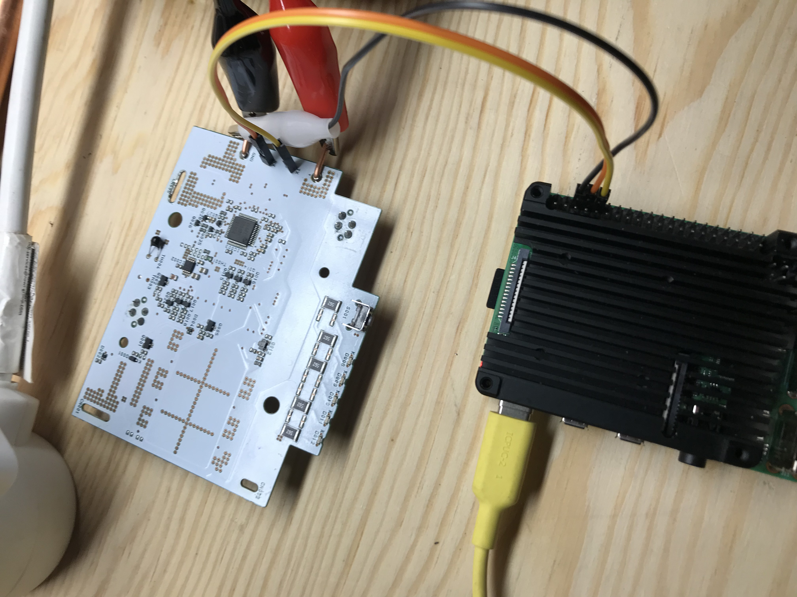
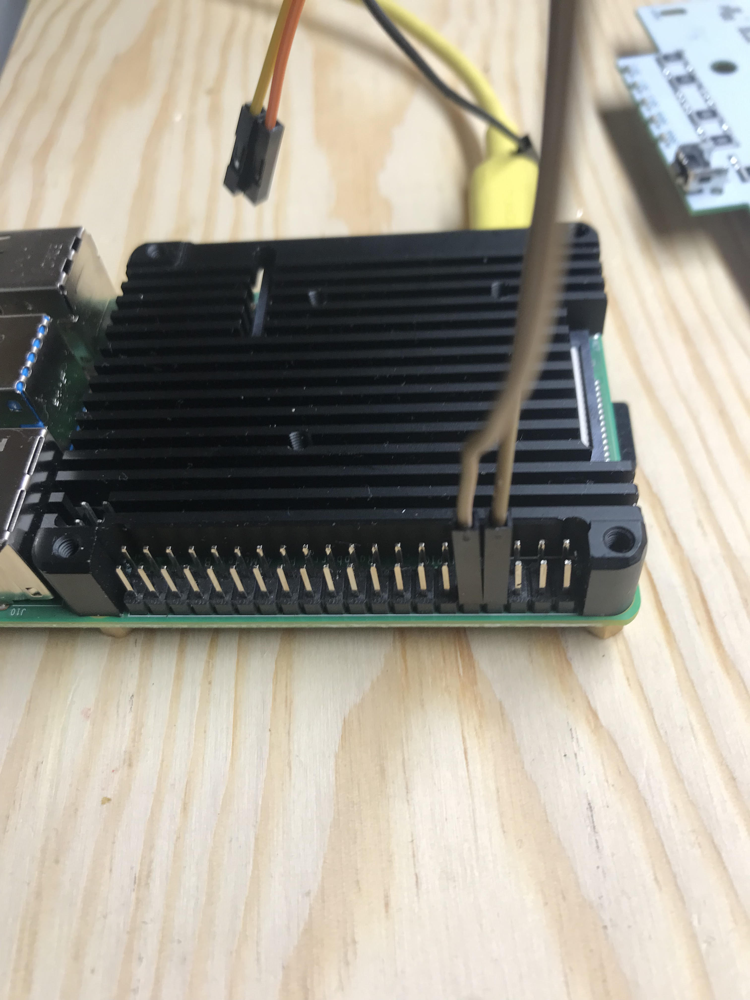

# SUT — Shimano UART Tool

SUT (Shimano UART Tool) is a Python tool for monitoring and analyzing Shimano e-bike UART traffic using a raspberry pi.
It can capture messages from Shimano components (battery, motor, display) and optionally send test data via a named pipe.




## Installation

```bash
sudo apt update && sudo apt install -y git
cd ~
git clone https://github.com/ottelo9/sut_ottelo.git
cd sut_ottelo
```

Update:
```bash
cd ~/sut_ottelo
git pull
```

## Running the Tool
Make sure your uart0/serial0 is enabled, and raspberry pi bt is not using it.

```
systemctl is-enabled serial-getty@ttyAMA0.service
systemctl is-active serial-getty@ttyAMA0.service
```

should return
>disabled  
>inactive

if not use 

```
sudo raspi-config
```
and select

>3\. Interface Options  
>I6. Serial Port  
>=> Would you like a login shell to be accessible over serial  
>NO  
>=> Would you like the serial port hardware to be enabled  
>YES  

/boot/firmware/config.txt
```
[all]
enable_uart=1
dtoverlay=disable-bt
```
Reboot after changes.

```
ls -l /dev/serial*
```
should return
```
/dev/serial0 -> ttyAMA0
```
Then you are good to go.

Activate your Python environment and start the tool:

```bash
./run.sh
```

Example output when starting:
```
Activating venv
Start tool
```

Press Ctrl+C to exit cleanly.

## Sending Data via Pipe

SUT can send raw bytes to the bus using a named pipe. This is useful for testing or simulating messages.

The tool takes care of creating the named pipe, so make sure it is running.

Send a test message to the pipe:

```bash
echo -ne '\x00\x42\x00\x00\x00' > /tmp/sut_pipe
```
Expected tool output:
```
S: 00 42 00 91 7A
R: 00 C2 00 5D F6
```
S: — message sent to the bus  
R: — message received from the bus

This acts as a simple sanity check to verify the tool is reading and sending messages correctly.

## Loopback testing
If you want to make sure everything on the pi side is up and running you can do a loopback test.

Connect RX and TX on your pi together



Run the tool, pipe in the command as described above.

Expected tool output:
```
S: 00 42 00 91 7A
R: 00 42 00 91 7A
```

Please make sure to not include this loopback test in your logging data, either by manually removing it from the days data file, or disabling logging in config.json before starting the tool with:

```
{
    "logger": false
}
```

## Dual-Channel Sniffing

When `tx_enabled` is set to `false` in `config.json`, the tool uses both GPIO pins as inputs to passively sniff both directions of the bus simultaneously:

| Channel | Pin | Method | Output |
|---------|-----|--------|--------|
| CH1 | GPIO15 (RX) | Hardware UART `/dev/serial0` | `R:` (normal) |
| CH2 | GPIO14 (TX) | pigpio bit-bang serial | `R2:` (cyan) |

### Setup

pigpio is not available via apt on Raspberry Pi OS Bookworm. Install from source:

```bash
wget https://github.com/joan2937/pigpio/archive/refs/heads/master.zip
unzip master.zip
cd pigpio-master
make
sudo make install
```

Start the daemon:

```bash
sudo pigpiod
```

To start pigpiod automatically on boot, add `sudo pigpiod` to `/etc/rc.local`.

### Config

Set `tx_enabled` to `false` in `config.json` to activate dual-channel mode:

```json
{
    "uart": {
        "port": "/dev/serial0",
        "baud": 9600,
        "tx_enabled": false,
        "tx_gpio": 14
    }
}
```

If pigpio is not installed or pigpiod is not running, the tool falls back to single-channel mode (CH1 only) with a warning.

## Battery Simulator Mode

The tool can impersonate a Shimano BT-E6000 battery on the UART bus, responding to charger handshakes and polls with configurable telemetry data.

**WARNING:** Do NOT connect a real battery when using simulator mode. The charger will deliver current without real BMS protection.

### Starting Simulator Mode

Run the tool and select mode 2 at the startup menu:

```
========================================
  Select Mode
========================================
  1) Logging Mode      (RX + RX2 sniffing)
  2) Simulator Mode    (Battery BMS simulation)
========================================
  Select [1/2]: 2
```

The simulator automatically:
- Enables TX on GPIO14
- Responds to charger handshakes (0x40→0xC0)
- Sends telemetry (Cmd 0x10, Length=22) every 3rd poll
- Sends ack pairs between telemetry (CRC=0x0000, like real battery)
- Transitions through states: Init (1s) → Precharge (2s) → Charging

### Config

For simulator mode, `tx_enabled` can remain `false` in config.json — the tool overrides it automatically:

```json
{
    "uart": {
        "port": "/dev/serial0",
        "baud": 9600,
        "tx_enabled": false,
        "tx_gpio": 14
    }
}
```

### Runtime Commands

Adjust simulated values while running:

| Command | Example | Description |
|---------|---------|-------------|
| `voltage <mV>` | `voltage 38300` | Set pack voltage (auto-calculates cell voltages) |
| `soc <percent>` | `soc 62` | Set state of charge |
| `temp <max> <avg> <th002>` | `temp 22 21 22` | Set NTC MAX, NTC AVG, TH002 temperatures |
| `status` | `status` | Show current simulator state and values |
| `help` | `help` | List available commands |

## Colored Output

|Color   |Meaning                    |
|--------|---------------------------|
|(normal)|Valid message received (CH1)|
|Cyan    |Valid message received (CH2)|
|Yellow  |Incomplete message detected|
|Red     |CRC error detected         |


Press Ctrl+C to exit.
The tool will cleanly close the serial port and any open pipes.

## Analyzing Data with DuckDB

Logged data (NDJSON files in `data/`) can be queried with DuckDB.

### Installing DuckDB

Download the prebuilt binary for Raspberry Pi (aarch64):

```bash
wget https://github.com/duckdb/duckdb/releases/latest/download/duckdb_cli-linux-arm64.zip
unzip duckdb_cli-linux-arm64.zip
sudo mv duckdb /usr/local/bin/
```

Alternatively, build from source:

```bash
sudo apt-get update
sudo apt-get install -y git g++ cmake ninja-build

git clone https://github.com/duckdb/duckdb
cd duckdb
GEN=ninja BUILD_EXTENSIONS="icu;json" make
sudo mv build/release/duckdb /usr/local/bin/
```

### Querying Log Data

Run a predefined query:

```bash
duckdb :memory: -f sql/charger_telemetry.sql
```

Available queries in `sql/`:

| File | Description |
|------|-------------|
| `00_80_16_10.sql` | PCB telemetry analysis (Cmd 0x10, Seq 0) |
| `charger_telemetry.sql` | Charger/battery telemetry (all Cmd 0x10) |

Or run an ad-hoc query:

```bash
duckdb :memory: -c "SELECT * FROM read_ndjson_auto('data/2026/03/28.ndjson') LIMIT 10;"
```

## ESP32 TinyC Variant — `Tasmota-TinyC/ShimanoSniffer.tc`

A second implementation runs on an ESP32 with [Tasmota TinyC](https://github.com/gemu2015/Sonoff-Tasmota/tree/universal/tasmota/tinyc) for standalone, network-connected operation (no Pi needed). The same Shimano protocol decoder, plus three operating modes selectable from a Tasmota web UI:

| Mode | Behavior |
|------|----------|
| **Sniffer** | Passive dual-channel capture on GPIO18 (charger/motor TX) and GPIO19 (battery TX). Logs decoded frames live, optionally to flash file `/shimano.log`. |
| **Simulator** | ESP32 acts as motor or charger. One click on `[Sim-Motor]` runs the full wake sequence (cold-wake handshake bursts → Auth replay → Boot Poll → DevInfo → First Ready → Trip → continuous steady polling). `[Sim-Charger]` does the equivalent for charger mode. `[Shutdown]` cleanly powers the BMS down. **Verified to release the discharge MOSFETs on BT-E6000 without bike or charger present.** |
| **Sim-BMS** | ESP32 impersonates the battery, responds to motor/charger requests with configurable fake telemetry (SOC, Vbat). Useful for testing motor/display behavior without an actual battery. |

### Hardware

ESP32 dev board, 3 wires to the battery connector (GND, B-TX → GPIO19, B-RX → GPIO18). Recommended: 5 kΩ pull-up on GPIO19 to 3.3V (stable UART idle when battery disconnected) and 5 kΩ pull-down on GPIO18 to GND (prevents accidental BMS wake while sniffing).

### Critical implementation detail

The BMS validates inter-byte UART timing during Auth — bytes must arrive with ~1-3 ms gaps. The TinyC code sends each byte via `serialWriteByte` with `delayMicroseconds(2500)` between calls. Sending whole frames via `serialWriteBytes(buf, len)` (back-to-back) is silently rejected by the BMS even with valid CRCs, returning a degraded `30 12` Auth-Resp and flipping fault byte to `0x15` after ~8s. See [docs/protocol_analysis.md](docs/protocol_analysis.md) for the full protocol decode.

### Deploy

Flash a Tasmota-TinyC build onto an ESP32 (instructions: gemu2015 repo above), then upload `Tasmota-TinyC/ShimanoSniffer.tc` via Tasmota's file manager. Restart, open the device's web UI, and the Shimano page appears in the menu.

## Notes

Requires Python 3.8+
CRC16 calculation and UART parsing are handled automatically
Currently only tested on BT-E6000